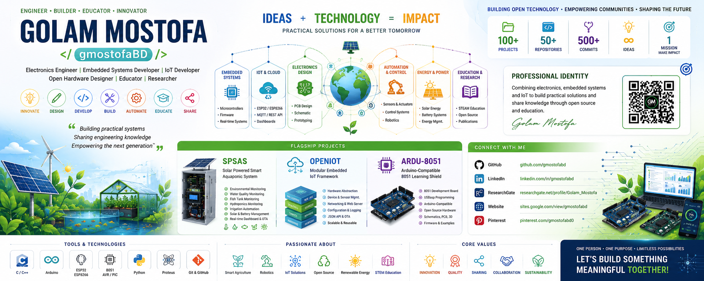

<a href="https://komarev.com/ghpvc/?username=gmostofabd">
  
</a> 


<hr/>


<div align="center">

# Golam Mostofa

### `gmostofaBD` · Electronics · Embedded Systems · IoT · Open Hardware · STEAM Education


</div>

---

## 👋 About Me

I am **Golam Mostofa (`gmostofaBD`)**, an electronics and embedded-systems professional working across **microcontrollers, IoT, PCB design, automation, open hardware, robotics and engineering education**.

My work connects traditional embedded platforms such as **8051, AVR and PIC** with modern **Arduino, ESP8266 and ESP32** systems.

I enjoy taking an idea from:

**Concept → Circuit → Firmware → Connected System → Dashboard → Real-World Application**

> **Build practical systems. Document the knowledge. Open the technology. Educate the next generation.**

---

## 🧭 My Competency Map

| Area | Competencies |
|---|---|
| 🔌 **Embedded Systems** | C/C++, firmware, microcontrollers, peripherals, real-time systems |
| 🧠 **Microcontrollers** | 8051, AVR, PIC, Arduino, ESP8266, ESP32 |
| 🌐 **IoT & Connectivity** | MQTT, REST APIs, JSON, web servers, OTA, dashboards |
| ⚡ **Electronics** | Sensors, actuators, analog/digital electronics, instrumentation |
| 🧩 **PCB & Hardware** | Schematics, PCB design, prototyping, open hardware |
| 🤖 **Automation & Robotics** | Control systems, motors, sensors, automation |
| ☀️ **Energy Systems** | Solar power, battery monitoring, energy management |
| 🌱 **Smart Agriculture** | Aquaponics, hydroponics, irrigation, environmental monitoring |
| 🧪 **Simulation** | Proteus, embedded-system simulation and testing |
| 🎓 **Education** | STEM/STEAM, practical electronics, embedded-system learning |
| 🌍 **Open Source** | Reusable firmware, hardware resources, documentation and collaboration |

---

# 🚀 Flagship Projects

## 🌱 ESP-OTA-Web-Dashboard-Framework

Modular ESP web dashboard framework with real-time monitoring, device control,, OTA updates and more...

### System Capabilities

- 🌡️ Environmental monitoring
- 💧 Water-quality monitoring
- 🐟 Fish-tank monitoring
- 🌱 Hydroponic monitoring
- 🚿 Irrigation automation
- ☀️ Solar-energy monitoring
- 🔋 Battery and power management
- 📡 Distributed controller architecture
- 🌐 ESP32 embedded web server
- 📊 Real-time dashboard
- 🔄 OTA firmware updates
- 🔌 REST/JSON communication

**Technology:**  
`ESP32` `Arduino` `I²C` `UART` `Sensors` `JSON` `Web Server` `OTA` `IoT` `Solar Energy`

👉 **Explore:** [GitHub Projects](https://github.com/gmostofabd)

---

## 🧩 OpenIoT Framework

A modular embedded-IoT architecture focused on building **reusable, maintainable and scalable firmware** instead of isolated sketches.

### Architectural Focus

```text
Application
    │
    ▼
IoT / Web / API
    │
    ▼
Services & Managers
    │
    ├── Sensor Management
    ├── Device Management
    ├── Logging
    ├── Networking
    ├── Configuration
    └── OTA
    │
    ▼
Hardware Abstraction
    │
    ▼
Microcontroller / Peripherals
````

**Technology:**
`C++` `Arduino` `ESP32` `Embedded Architecture` `IoT`

👉 **Explore:** [GitHub](https://github.com/gmostofabd)

---

## ⚙️ ARDU-8051

### Arduino-Compatible Open-Source 8051 Learning Hardware

An open hardware platform designed to make **8051 microcontroller experimentation and embedded-systems education** more accessible.

### Includes

* 8051 development hardware
* USBasp programming
* Arduino-style interface
* Schematic and PCB resources
* 3D design resources
* Firmware
* Educational examples

**Technology:**
`8051` `AT89S52` `USBasp` `PCB` `Open Hardware` `Embedded Education`

👉 **Repository:**
[ARDU-8051](https://github.com/gmostofabd/ARDU-8051)

🔬 **Research:**
[ResearchGate](https://www.researchgate.net/)

---

# 🔬 Research & Engineering Interests

### Embedded Systems

`Embedded C/C++` · `Firmware` · `MCU Architecture` · `Peripheral Interfacing` · `Distributed Controllers`

### Electronics & Hardware

`Circuit Design` · `PCB Design` · `Sensors` · `Actuators` · `Instrumentation` · `Power Electronics`

### IoT

`ESP32` · `ESP8266` · `MQTT` · `REST` · `JSON` · `Web Servers` · `OTA` · `Cloud Connectivity`

### Smart Systems

`Aquaponics` · `Hydroponics` · `Smart Agriculture` · `Renewable Energy` · `Automation` · `Robotics`

### Engineering Education

`STEM/STEAM` · `Microcontrollers` · `Practical Electronics` · `Proteus` · `Open Educational Hardware`

---

# 📚 Research & Publications

## ARDU-8051 — An Arduino-Compatible Open-Source 8051 Learning Hardware Shield

Research and development of an open 8051 learning platform combining classical microcontroller technology with an Arduino-style development experience.

**Author:** Golam Mostofa
**Institution:** Islamic University of Technology

🔬 [View on ResearchGate](https://www.researchgate.net/publication/399465555_Design_and_Development_of_ARDU-8051_-_An_Arduino-Compatible_Open-Source_8051_Learning_Hardware_Shield)

🔧 [Open-source implementation](https://github.com/gmostofabd/ARDU-8051)

---


## 🌐 Engineering Portfolio


<div align="center">



</div>


My work includes practical projects in:

* Arduino development
* 8051 / AVR / PIC systems
* ESP32 / ESP8266 IoT
* Proteus simulation
* PCB design
* Sensors and instrumentation
* Robotics
* Automation
* Smart agriculture
* Renewable-energy systems
* Embedded web interfaces
* Educational electronics

👉 [Visit my portfolio](https://sites.google.com/view/gmostofabd/)

---

# 🛠️ Technology Stack

<div align="center">

### Languages

`C` `C++` `Assembly` `Python` `JavaScript` `HTML` `CSS`

### Hardware

`ESP32` `ESP8266` `Arduino` `AVR` `8051` `PIC`

### Communication

`I²C` `UART` `SPI` `MQTT` `REST` `JSON`

### Tools

`Arduino IDE` `VS Code` `Git` `GitHub` `Proteus`

### Engineering

`PCB Design` `Circuit Design` `Embedded Firmware` `IoT` `Automation` `Robotics`

</div>

---

# 🏗️ How I Build Systems

```text
                ┌─────────────────────┐
                │       IDEA          │
                └──────────┬──────────┘
                           │
                           ▼
                ┌─────────────────────┐
                │  SYSTEM DESIGN      │
                │ Hardware + Software │
                └──────────┬──────────┘
                           │
             ┌─────────────┴─────────────┐
             ▼                           ▼
      ┌─────────────┐             ┌─────────────┐
      │   HARDWARE  │             │   FIRMWARE  │
      │ PCB / MCU   │             │ C / C++     │
      │ Sensors     │             │ Drivers     │
      └──────┬──────┘             └──────┬──────┘
             │                           │
             └─────────────┬─────────────┘
                           ▼
                ┌─────────────────────┐
                │   CONNECTED SYSTEM  │
                │ IoT / API / Web     │
                └──────────┬──────────┘
                           │
                           ▼
                ┌─────────────────────┐
                │ APPLICATION / UI    │
                │ Dashboard / Mobile  │
                └──────────┬──────────┘
                           │
                           ▼
                ┌─────────────────────┐
                │   REAL-WORLD USE    │
                └─────────────────────┘
```

---

# 🌍 Open Source Philosophy

I believe engineering knowledge becomes more valuable when it is:

**Built → Tested → Documented → Shared → Reused**

My repositories aim to make practical engineering resources available through:

* 💻 Source code
* 🔧 Firmware
* 🔌 Schematics
* 🧪 Simulations
* 🧩 PCB designs
* 📦 Libraries
* 📚 Documentation
* 🎓 Educational examples
* 🌐 IoT systems

---

# 🎯 Current Focus

### 🌱 SPSAS

**Smart agriculture + IoT + renewable energy**

### 🧩 OpenIoT

**Modular embedded IoT architecture**

### ⚙️ ARDU-8051

**Open-source embedded education hardware**

### 🔬 Arduino + Proteus Ecosystem

**Practical electronics, simulation and learning resources**

---

# 🤝 Collaboration

I am interested in collaborating on:

* Embedded systems
* ESP32 / Arduino
* IoT
* Open hardware
* PCB design
* Robotics
* Smart agriculture
* Renewable-energy systems
* Electronics education
* Embedded software architecture
* STEM/STEAM projects

If a project is useful to you:

**⭐ Star · 🍴 Fork · 🐛 Report · 🔧 Contribute · 📢 Share**

---

# 🌐 Connect With Me

| Platform        | Profile                                                  |
| --------------- | -------------------------------------------------------- |
| 💻 GitHub       | [@gmostofabd](https://github.com/gmostofabd)             |
| 💼 LinkedIn     | [Golam Mostofa](https://www.linkedin.com/in/gmostofabd/) |
| 🔬 ResearchGate | [Golam Mostofa](https://www.researchgate.net/)           |
| 🌐 Website      | [gmostofaBD](https://sites.google.com/view/gmostofabd/)  |
| 📌 Pinterest    | [@gmostofabd0](https://www.pinterest.com/gmostofabd0/)   |

---

# 🌟 Vision

```text
       OPEN HARDWARE
             +
      EMBEDDED SOFTWARE
             +
             IoT
             +
      RENEWABLE ENERGY
             +
        SMART SYSTEMS
             +
   ENGINEERING EDUCATION
             │
             ▼
    PRACTICAL OPEN TECHNOLOGY
```

> **One professional identity. Multiple platforms. Shared knowledge. Real-world impact.**

---

<div align="center">

## ⚡ Hardware → Firmware → IoT → Intelligence → Real World

### **Golam Mostofa · gmostofaBD**

*Building practical systems. Sharing engineering knowledge.*

</div>
added a mosfet driver part and a transformer as well. 🤖🔧

---

### :star: [**Add New Libraries to Proteus**](https://gmostofabd.github.io/Proteus-Libraries/)

A collection of **Proteus Simulation Models**, **PCB Footprints**, and **3D Models** for common devices not included in the default software. Enhance your design with essential components and improve your simulation accuracy. 🌟

---


### :rocket: [**Technocraphy BD**](https://github.com/technocraphybd)

Promotes STEAM education in Bangladesh with engaging learning experiences in robotics, IoT, and technology. 🚀🎓

---

<br>

###  My Attachments:

**Engineer [@IUT](https://www.iutoic-dhaka.edu/) | Designer @melabBD | Educator @TechnocraphyBD**
<br>
<hr/>
<br>


###  👨‍💻  **Check Out My Projects**
- [Discover My Work](https://sites.google.com/view/gmostofabd/projects/)
-  [https://sites.google.com/view/gmostofabd/projects/](https://sites.google.com/view/gmostofabd/projects?authuser=0)

<br>
<hr/>
<br>

### 🐍 **My Contributions**
- **GitHub Tutorials**: Extensive tutorials on Embedded Systems, Robotics, and more.
- **YouTube & Blogs**: Educational content and discussions on various technical subjects.
- **STEAM Education**: Leading Technocraphy BD to inspire young minds with hands-on learning. At Technocraphy BD, we focus on promoting STEAM (Science, Technology, Engineering, Arts, and Mathematics) education across Bangladesh. We provide engaging, hands-on learning experiences in robotics, IoT, and other technological fields, aiming to spark curiosity and foster skills in the next generation of innovators.
- **melab BD**: At melab BD, we specialize in the design, development, and consultancy of Embedded Systems, Robotics, IoT solutions, and Industrial Automation. We also offer comprehensive training in microcontroller programming, PCB design, and more, helping clients and students alike achieve their engineering goals.

<br>
<hr/>
<br>


[](https://github.com/cheehwatang/github-readme-daily-quotes)

<hr style="border: none; height: 2px; background-color: #2E8B57; margin-top: 20px; margin-bottom: 20px; border-radius: 5px;"/>
<p align="center">
  
<a href="https://github.com/gmostofabd?tab=repositories" target="_blank"></a>

</p>

---

<p align="center"> © 2021 gmostofaBD, all rights reserved.</p>
